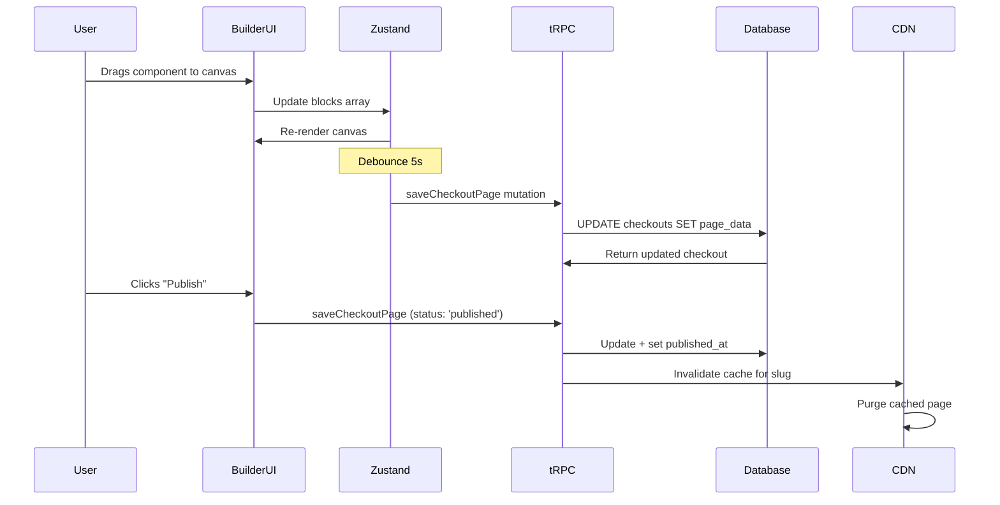
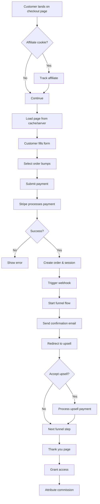

# **Checkout Panda - Technical Product Requirements Document**

**Version 4.0 | August 2025**

---

## **Table of Contents**

1. [Executive Summary](#executive-summary)
2. [Product Vision & Strategy](#product-vision)
3. [Technical Architecture](#technical-architecture)
4. [P0 Features (MVP) - Complete Specifications](#p0-features)
5. [P1 Features (Phase 2) - Complete Specifications](#p1-features)
6. [P2 Features (Future) - Complete Specifications](#p2-features)
7. [Data Flow Architecture](#data-flow)
8. [Performance & Security](#performance-security)
9. [Success Metrics & Analytics](#metrics)

---

## **1. Executive Summary** {#executive-summary}

Checkout Panda is an elite, conversion-focused checkout platform that transforms standard payment transactions into visually stunning, highly profitable customer journeys. Built with Next.js 15, TypeScript, and modern edge infrastructure, it provides knowledge entrepreneurs with a powerful alternative to the limited checkout systems in platforms like Circle and Kajabi.

### **Core Differentiators**

- **Visual Excellence**: Every interface follows Design-Guidelines.md with aurora gradients, glass morphism, and fluid animations
- **Intuitive Builder**: Drag-and-drop checkout page builder with real-time preview and device-specific optimization
- **Revenue Engine**: Sophisticated upsell flows, order bumps, and smart conditional logic
- **Performance**: Edge-optimized with <1.8s LCP and 99.95% uptime

---

## **2. Product Vision & Strategy** {#product-vision}

### **Mission Statement**

"Empower creators to unlock their true revenue potential through beautiful, intelligent checkout experiences that captivate customers and multiply profits."

### **Target Metrics**

- **Revenue Impact**: 20%+ increase in AOV for multi-step funnels
- **Builder Adoption**: 60% of creators publish a funnel within 14 days
- **Performance**: <1.8s checkout page load time
- **Reliability**: 99.95% uptime for checkout services

---

## **3. Technical Architecture** {#technical-architecture}

### **3.1 Technology Stack**

```typescript
// Core Stack (per CLAUDE.md)
{
  framework: "Next.js 15+ (App Router)",
  language: "TypeScript 5.3+ (Strict Mode)",
  auth: "Clerk",
  database: "Neon Serverless Postgres",
  orm: "Drizzle ORM",
  api: "tRPC with React Query",
  styling: "Tailwind CSS 4.0 + CVA",
  ui: "shadcn/ui + Radix UI + Framer Motion",
  forms: "React Hook Form + Zod",
  payments: "Stripe API",
  deployment: "Vercel Edge Functions",
  storage: "Vercel Blob"
}
```

### **3.2 Comprehensive Database Schema**

```typescript
// src/server/db/schema.ts
import {
  pgTable,
  text,
  uuid,
  timestamp,
  integer,
  boolean,
  jsonb,
  pgEnum,
  index,
} from 'drizzle-orm/pg-core'
import { relations } from 'drizzle-orm'

// Enums
export const checkoutStatusEnum = pgEnum('checkout_status', ['draft', 'published', 'archived'])
export const blockTypeEnum = pgEnum('block_type', [
  'hero',
  'product',
  'payment',
  'bump',
  'testimonial',
  'trust',
  'custom',
])

// Users (from Clerk)
export const users = pgTable('users', {
  id: text('id').primaryKey(), // Clerk user ID
  email: text('email').notNull().unique(),
  stripeCustomerId: text('stripe_customer_id').unique(),
  createdAt: timestamp('created_at').defaultNow(),
})

// Checkouts - The main entity
export const checkouts = pgTable(
  'checkouts',
  {
    id: uuid('id').defaultRandom().primaryKey(),
    userId: text('user_id')
      .notNull()
      .references(() => users.id),
    name: text('name').notNull(),
    slug: text('slug').notNull(),
    status: checkoutStatusEnum('status').default('draft'),

    // Page builder data
    pageData: jsonb('page_data')
      .$type<{
        blocks: Array<{
          id: string
          type: string
          data: any
          styles: any
          position: number
        }>
        settings: {
          theme: string
          customCss?: string
          seoMeta?: any
        }
      }>()
      .notNull(),

    // A/B Testing
    isTestVariant: boolean('is_test_variant').default(false),
    parentCheckoutId: uuid('parent_checkout_id').references(() => checkouts.id),

    // Analytics
    views: integer('views').default(0),
    conversions: integer('conversions').default(0),
    revenue: integer('revenue').default(0), // in cents

    // Timestamps
    publishedAt: timestamp('published_at'),
    createdAt: timestamp('created_at').defaultNow(),
    updatedAt: timestamp('updated_at').defaultNow(),
  },
  (table) => ({
    slugIndex: index('checkout_slug_idx').on(table.slug),
    userIdIndex: index('checkout_user_id_idx').on(table.userId),
  })
)

// Products
export const products = pgTable('products', {
  id: uuid('id').defaultRandom().primaryKey(),
  userId: text('user_id')
    .notNull()
    .references(() => users.id),
  name: text('name').notNull(),
  description: text('description'),
  price: integer('price').notNull(), // in cents
  stripeProductId: text('stripe_product_id'),
  stripePriceId: text('stripe_price_id'),

  // For subscriptions
  isRecurring: boolean('is_recurring').default(false),
  interval: text('interval'), // 'month', 'year', etc.
  intervalCount: integer('interval_count').default(1),

  createdAt: timestamp('created_at').defaultNow(),
})

// Order Bumps
export const orderBumps = pgTable('order_bumps', {
  id: uuid('id').defaultRandom().primaryKey(),
  checkoutId: uuid('checkout_id')
    .notNull()
    .references(() => checkouts.id),
  productId: uuid('product_id')
    .notNull()
    .references(() => products.id),

  // Display settings
  headline: text('headline').notNull(),
  description: text('description'),
  imageUrl: text('image_url'),
  badge: text('badge'),
  discountPercent: integer('discount_percent'),

  // Analytics
  views: integer('views').default(0),
  conversions: integer('conversions').default(0),

  active: boolean('active').default(true),
  createdAt: timestamp('created_at').defaultNow(),
})

// Funnel Flows
export const funnels = pgTable('funnels', {
  id: uuid('id').defaultRandom().primaryKey(),
  userId: text('user_id')
    .notNull()
    .references(() => users.id),
  checkoutId: uuid('checkout_id').references(() => checkouts.id),
  name: text('name').notNull(),

  // React Flow data
  flowData: jsonb('flow_data')
    .$type<{
      nodes: Array<{
        id: string
        type: 'trigger' | 'upsell' | 'downsell' | 'condition' | 'thankYou'
        position: { x: number; y: number }
        data: any
      }>
      edges: Array<{
        id: string
        source: string
        target: string
        data?: {
          condition?: any
        }
      }>
    }>()
    .notNull(),

  active: boolean('active').default(true),
  createdAt: timestamp('created_at').defaultNow(),
  updatedAt: timestamp('updated_at').defaultNow(),
})

// Sessions (for tracking funnel progress)
export const checkoutSessions = pgTable('checkout_sessions', {
  id: uuid('id').defaultRandom().primaryKey(),
  checkoutId: uuid('checkout_id')
    .notNull()
    .references(() => checkouts.id),
  customerId: text('customer_id'), // Can be null for guest checkout

  // Session state
  currentStep: text('current_step').default('checkout'),
  sessionData: jsonb('session_data')
    .$type<{
      productsPurchased: string[]
      totalSpent: number
      bumpsAccepted: string[]
      upsellsAccepted: string[]
      customerEmail?: string
      metadata?: any
    }>()
    .default({}),

  // Payment
  stripePaymentIntentId: text('stripe_payment_intent_id'),
  paymentMethodId: text('payment_method_id'),

  completedAt: timestamp('completed_at'),
  createdAt: timestamp('created_at').defaultNow(),
  expiresAt: timestamp('expires_at').notNull(),
})

// Analytics Events
export const analyticsEvents = pgTable(
  'analytics_events',
  {
    id: uuid('id').defaultRandom().primaryKey(),
    checkoutId: uuid('checkout_id')
      .notNull()
      .references(() => checkouts.id),
    sessionId: uuid('session_id').references(() => checkoutSessions.id),

    eventType: text('event_type').notNull(), // 'page_view', 'bump_view', 'bump_accept', 'purchase', 'upsell_view', 'upsell_accept'
    eventData: jsonb('event_data'),

    timestamp: timestamp('timestamp').defaultNow(),
  },
  (table) => ({
    checkoutIdIndex: index('event_checkout_id_idx').on(table.checkoutId),
    timestampIndex: index('event_timestamp_idx').on(table.timestamp),
  })
)
```

### **3.3 API Layer Architecture**

```typescript
// src/server/api/root.ts
export const appRouter = createTRPCRouter({
  auth: authRouter,
  checkout: checkoutRouter,
  checkoutBuilder: checkoutBuilderRouter,
  funnel: funnelRouter,
  product: productRouter,
  analytics: analyticsRouter,
  payment: paymentRouter,
})

// src/server/api/routers/checkout-builder.ts
export const checkoutBuilderRouter = createTRPCRouter({
  // Load checkout page data
  getCheckoutPage: protectedProcedure
    .input(
      z.object({
        checkoutId: z.string().uuid(),
      })
    )
    .query(async ({ ctx, input }) => {
      const checkout = await ctx.db.query.checkouts.findFirst({
        where: and(eq(checkouts.id, input.checkoutId), eq(checkouts.userId, ctx.userId)),
      })

      if (!checkout) throw new TRPCError({ code: 'NOT_FOUND' })

      return checkout
    }),

  // Save checkout page (debounced auto-save)
  saveCheckoutPage: protectedProcedure
    .input(
      z.object({
        checkoutId: z.string().uuid(),
        pageData: z.object({
          blocks: z.array(z.any()),
          settings: z.any(),
        }),
        status: z.enum(['draft', 'published']).optional(),
      })
    )
    .mutation(async ({ ctx, input }) => {
      const updated = await ctx.db
        .update(checkouts)
        .set({
          pageData: input.pageData,
          status: input.status,
          updatedAt: new Date(),
          publishedAt: input.status === 'published' ? new Date() : undefined,
        })
        .where(and(eq(checkouts.id, input.checkoutId), eq(checkouts.userId, ctx.userId)))
        .returning()

      // Invalidate CDN cache if published
      if (input.status === 'published') {
        await invalidateCheckoutCache(updated[0].slug)
      }

      return updated[0]
    }),

  // Duplicate checkout
  duplicateCheckout: protectedProcedure
    .input(
      z.object({
        checkoutId: z.string().uuid(),
        name: z.string(),
      })
    )
    .mutation(async ({ ctx, input }) => {
      const original = await ctx.db.query.checkouts.findFirst({
        where: and(eq(checkouts.id, input.checkoutId), eq(checkouts.userId, ctx.userId)),
      })

      if (!original) throw new TRPCError({ code: 'NOT_FOUND' })

      const newCheckout = await ctx.db
        .insert(checkouts)
        .values({
          userId: ctx.userId,
          name: input.name,
          slug: generateSlug(input.name),
          pageData: original.pageData,
          status: 'draft',
        })
        .returning()

      return newCheckout[0]
    }),
})
```

---

## **4. P0 Features (MVP) - Complete Specifications** {#p0-features}

### **4.1 Drag-and-Drop Checkout Page Builder**

#### **4.1.1 System Architecture**

```typescript
interface CheckoutBuilderSystem {
  frontend: {
    layout: {
      structure: 'Three-panel: Component Library (left), Canvas (center), Properties (right)'
      responsive: 'Collapsible panels for tablet/mobile editing'
    }

    stateManagement: {
      library: 'Zustand'
      stores: {
        builderStore: {
          blocks: Block[]
          selectedBlockId: string | null
          isDragging: boolean
          canvasSettings: CanvasSettings
          history: HistoryState // Undo/redo
        }
      }
    }

    dragAndDrop: {
      library: '@dnd-kit/core + @dnd-kit/sortable'
      features: ['Magnetic snapping', 'Grid alignment', 'Collision detection']
    }
  }

  backend: {
    persistence: {
      strategy: 'Debounced auto-save (5s delay)'
      endpoint: 'checkoutBuilder.saveCheckoutPage'
      optimisticUpdates: true
    }

    rendering: {
      strategy: 'Server-side for published pages'
      caching: 'Vercel Edge Cache + stale-while-revalidate'
    }
  }
}
```

#### **4.1.2 Component Library Implementation**

```typescript
// src/components/builder/blocks/index.ts
export const blockRegistry: BlockRegistry = {
  hero: {
    component: HeroBlock,
    icon: Layout,
    name: 'Hero Section',
    defaultData: {
      headline: 'Complete Your Purchase',
      subheadline: "You're one step away from transformation",
      backgroundType: 'gradient',
      gradient: { type: 'aurora', animate: true },
    },
  },
  product: {
    component: ProductShowcaseBlock,
    icon: ShoppingBag,
    name: 'Product Showcase',
    defaultData: {
      layout: 'side-by-side',
      showPricing: true,
      features: [],
    },
  },
  payment: {
    component: PaymentFormBlock,
    icon: CreditCard,
    name: 'Payment Form',
    defaultData: {
      showExpressCheckout: true,
      fields: ['email', 'card'],
    },
  },
  bump: {
    component: OrderBumpBlock,
    icon: Gift,
    name: 'Order Bump',
    defaultData: {
      style: 'highlighted',
      animation: 'pulse',
    },
  },
  // ... more blocks
}
```

#### **4.1.3 Data Flow: Builder to Database**



#### **4.1.4 Detailed Component Example: Hero Block**

```typescript
// src/components/builder/blocks/hero-block.tsx
interface HeroBlockData {
  headline: string;
  subheadline?: string;
  backgroundType: 'gradient' | 'image' | 'video';
  gradient?: {
    type: 'aurora' | 'sunset' | 'ocean' | 'custom';
    colors?: string[];
    animate: boolean;
  };
  image?: {
    url: string;
    overlay: boolean;
    overlayOpacity: number;
  };
  cta?: {
    enabled: boolean;
    text: string;
    scrollTarget: string;
  };
}

export function HeroBlock({
  block,
  isEditing,
  onUpdate
}: BlockProps<HeroBlockData>) {
  const { data, styles } = block;

  // Editing mode shows placeholder content
  const headline = isEditing && !data.headline
    ? 'Click to edit headline'
    : data.headline;

  return (
    <section
      className={cn(
        "relative overflow-hidden",
        styles.padding || "py-20 px-6",
        styles.className
      )}
      style={{
        minHeight: styles.minHeight || '60vh',
      }}
    >
      {/* Background Layer */}
      <BackgroundLayer
        type={data.backgroundType}
        gradient={data.gradient}
        image={data.image}
      />

      {/* Content Layer */}
      <div className="relative z-10 max-w-6xl mx-auto text-center">
        {isEditing ? (
          <EditableText
            value={headline}
            onChange={(value) => onUpdate({ headline: value })}
            className="text-5xl md:text-7xl font-bold mb-6"
            placeholder="Enter headline"
          />
        ) : (
          <motion.h1
            initial={{ opacity: 0, y: 30 }}
            animate={{ opacity: 1, y: 0 }}
            transition={{ duration: 0.8, ease: "easeOut" }}
            className="text-5xl md:text-7xl font-bold mb-6"
          >
            <TextGradient gradient={data.gradient}>
              {headline}
            </TextGradient>
          </motion.h1>
        )}

        {data.subheadline && (
          <motion.p
            initial={{ opacity: 0, y: 20 }}
            animate={{ opacity: 1, y: 0 }}
            transition={{ delay: 0.2, duration: 0.8 }}
            className="text-xl md:text-2xl text-gray-600 dark:text-gray-300 max-w-3xl mx-auto"
          >
            {data.subheadline}
          </motion.p>
        )}

        {data.cta?.enabled && (
          <motion.div
            initial={{ opacity: 0, scale: 0.9 }}
            animate={{ opacity: 1, scale: 1 }}
            transition={{ delay: 0.4, duration: 0.6 }}
            className="mt-8"
          >
            <ScrollButton
              targetId={data.cta.scrollTarget}
              className="px-8 py-4 text-lg"
            >
              {data.cta.text}
            </ScrollButton>
          </motion.div>
        )}
      </div>

      {/* Floating Elements */}
      <FloatingOrbs animate={data.gradient?.animate} />
    </section>
  );
}
```

### **4.2 One-Click Post-Purchase Upsells**

#### **4.2.1 Complete System Architecture**

```typescript
interface UpsellSystem {
  trigger: {
    event: 'payment_intent.succeeded webhook'
    validation: 'Verify Stripe signature'
  }

  dataFlow: {
    sessionManagement: {
      storage: 'Database (checkout_sessions table)'
      expiry: '24 hours'
      security: 'Signed session tokens'
    }

    paymentMethod: {
      storage: 'Stripe Customer object'
      retrieval: 'stripe.paymentMethods.list()'
      security: 'Never store raw card data'
    }
  }

  execution: {
    frontend: {
      routing: '/funnel/[sessionId]/[step]'
      authentication: 'Session-based, no login required'
      components: 'Server Components with form actions'
    }

    backend: {
      chargeMethod: 'Stripe off-session payment'
      errorHandling: 'Graceful failures with customer notification'
      analytics: 'Track every view and action'
    }
  }
}
```

#### **4.2.2 Implementation Flow**

```typescript
// src/app/api/webhooks/stripe/route.ts
export async function POST(req: Request) {
  const body = await req.text()
  const signature = headers().get('stripe-signature')!

  let event: Stripe.Event

  try {
    event = stripe.webhooks.constructEvent(body, signature, env.STRIPE_WEBHOOK_SECRET)
  } catch (err) {
    return new Response('Webhook signature verification failed', { status: 400 })
  }

  if (event.type === 'payment_intent.succeeded') {
    const paymentIntent = event.data.object as Stripe.PaymentIntent

    // Start funnel flow
    await startFunnelFlow({
      paymentIntentId: paymentIntent.id,
      customerId: paymentIntent.customer as string,
      metadata: paymentIntent.metadata,
    })
  }

  return new Response('OK', { status: 200 })
}

async function startFunnelFlow({ paymentIntentId, customerId, metadata }) {
  // Get the checkout configuration
  const checkout = await db.query.checkouts.findFirst({
    where: eq(checkouts.id, metadata.checkoutId),
    with: { funnel: true },
  })

  if (!checkout?.funnel) return

  // Create session
  const session = await db
    .insert(checkoutSessions)
    .values({
      checkoutId: checkout.id,
      customerId,
      sessionData: {
        productsPurchased: [metadata.productId],
        totalSpent: parseInt(metadata.amount),
        bumpsAccepted: metadata.bumps ? JSON.parse(metadata.bumps) : [],
      },
      stripePaymentIntentId: paymentIntentId,
      expiresAt: new Date(Date.now() + 24 * 60 * 60 * 1000),
    })
    .returning()

  // Send email with funnel link
  await sendFunnelEmail({
    customerEmail: metadata.customerEmail,
    funnelUrl: `${env.NEXT_PUBLIC_APP_URL}/funnel/${session[0].id}/start`,
    checkoutName: checkout.name,
  })
}
```

#### **4.2.3 Upsell Page Implementation**

```typescript
// src/app/funnel/[sessionId]/[step]/page.tsx
export default async function UpsellPage({
  params
}: {
  params: { sessionId: string; step: string }
}) {
  // Verify session
  const session = await db.query.checkoutSessions.findFirst({
    where: and(
      eq(checkoutSessions.id, params.sessionId),
      gt(checkoutSessions.expiresAt, new Date())
    ),
    with: {
      checkout: {
        with: { funnel: true }
      }
    }
  });

  if (!session) {
    redirect('/checkout/session-expired');
  }

  // Get current offer from funnel flow
  const currentOffer = await getFunnelOffer({
    funnel: session.checkout.funnel,
    currentStep: params.step,
    sessionData: session.sessionData,
  });

  if (!currentOffer) {
    redirect(`/funnel/${params.sessionId}/thank-you`);
  }

  return (
    <UpsellPageLayout>
      <UpsellHeader
        urgency={currentOffer.urgency}
        timer={currentOffer.timer}
      />

      <UpsellContent
        offer={currentOffer}
        onAccept={acceptUpsell}
        onDecline={declineUpsell}
        sessionId={params.sessionId}
      />
    </UpsellPageLayout>
  );
}

// Server Actions
async function acceptUpsell(formData: FormData) {
  'use server';

  const sessionId = formData.get('sessionId') as string;
  const offerId = formData.get('offerId') as string;

  // Get session and payment method
  const session = await getValidSession(sessionId);
  const paymentMethodId = session.paymentMethodId;

  try {
    // Create off-session payment
    const paymentIntent = await stripe.paymentIntents.create({
      amount: offer.price,
      currency: 'usd',
      customer: session.customerId,
      payment_method: paymentMethodId,
      off_session: true,
      confirm: true,
      metadata: {
        sessionId,
        offerId,
        type: 'upsell',
      },
    });

    // Update session data
    await updateSessionData(sessionId, {
      upsellsAccepted: [...session.sessionData.upsellsAccepted, offerId],
      totalSpent: session.sessionData.totalSpent + offer.price,
    });

    // Track analytics
    await trackEvent({
      sessionId,
      eventType: 'upsell_accept',
      eventData: { offerId, amount: offer.price },
    });

    // Determine next step
    const nextStep = await getNextFunnelStep(session, 'accepted');
    redirect(`/funnel/${sessionId}/${nextStep}`);

  } catch (error) {
    // Handle payment failure gracefully
    console.error('Upsell payment failed:', error);
    redirect(`/funnel/${sessionId}/payment-failed`);
  }
}
```

### **4.3 Pre-Purchase Order Bumps**

#### **4.3.1 Frontend State Management**

```typescript
// src/stores/checkout-store.ts
import { create } from 'zustand'
import { immer } from 'zustand/middleware/immer'

interface CheckoutState {
  mainProduct: Product | null
  orderBumps: Record<string, boolean>
  customFields: Record<string, any>
  totalAmount: number

  // Actions
  toggleOrderBump: (bumpId: string, selected: boolean, price: number) => void
  calculateTotal: () => void
  resetCheckout: () => void
}

export const useCheckoutStore = create<CheckoutState>()(
  immer((set, get) => ({
    mainProduct: null,
    orderBumps: {},
    customFields: {},
    totalAmount: 0,

    toggleOrderBump: (bumpId, selected, price) => {
      set((state) => {
        state.orderBumps[bumpId] = selected
      })
      get().calculateTotal()
    },

    calculateTotal: () => {
      set((state) => {
        let total = state.mainProduct?.price || 0

        // Add selected bumps
        Object.entries(state.orderBumps).forEach(([bumpId, selected]) => {
          if (selected) {
            const bump = getBumpById(bumpId)
            if (bump) total += bump.price
          }
        })

        state.totalAmount = total
      })
    },

    resetCheckout: () => {
      set((state) => {
        state.orderBumps = {}
        state.customFields = {}
        state.totalAmount = state.mainProduct?.price || 0
      })
    },
  }))
)
```

#### **4.3.2 Order Bump Component**

```typescript
// src/components/checkout/order-bump-v2.tsx
export function OrderBumpV2({ bump, index }: Props) {
  const { toggleOrderBump, orderBumps } = useCheckoutStore();
  const isSelected = orderBumps[bump.id] || false;
  const [isAnimating, setIsAnimating] = useState(false);

  const handleToggle = (checked: boolean) => {
    setIsAnimating(true);
    toggleOrderBump(bump.id, checked, bump.price);

    // Track analytics
    trackEvent({
      eventType: checked ? 'bump_select' : 'bump_deselect',
      eventData: { bumpId: bump.id, price: bump.price },
    });

    // Haptic feedback
    if (window.navigator.vibrate) {
      window.navigator.vibrate(checked ? [10, 20, 10] : [10]);
    }

    setTimeout(() => setIsAnimating(false), 600);
  };

  return (
    <motion.div
      initial={{ opacity: 0, x: -20 }}
      animate={{ opacity: 1, x: 0 }}
      transition={{ delay: index * 0.1 }}
      className={cn(
        "relative group",
        isAnimating && "scale-[1.02] transition-transform"
      )}
    >
      <div className={cn(
        "relative overflow-hidden rounded-2xl border-2 transition-all duration-500",
        isSelected
          ? "border-primary bg-gradient-to-br from-primary/5 to-secondary/5 shadow-xl shadow-primary/10"
          : "border-dashed border-gray-300 dark:border-gray-700 hover:border-gray-400"
      )}>
        {/* Animated background */}
        <div className={cn(
          "absolute inset-0 bg-gradient-to-r from-primary/10 via-secondary/10 to-primary/10",
          "transition-opacity duration-700",
          isSelected ? "opacity-100 animate-gradient-shift" : "opacity-0"
        )} />

        {/* Success ripple effect */}
        <AnimatePresence>
          {isAnimating && isSelected && (
            <motion.div
              initial={{ scale: 0, opacity: 0.5 }}
              animate={{ scale: 4, opacity: 0 }}
              exit={{ opacity: 0 }}
              transition={{ duration: 0.6 }}
              className="absolute top-1/2 left-1/2 -translate-x-1/2 -translate-y-1/2 w-20 h-20 bg-green-500 rounded-full"
            />
          )}
        </AnimatePresence>

        <div className="relative z-10 p-6">
          <BumpContent
            bump={bump}
            isSelected={isSelected}
            onToggle={handleToggle}
          />
        </div>
      </div>
    </motion.div>
  );
}
```

---

## **5. P1 Features (Phase 2) - Complete Specifications** {#p1-features}

### **5.1 Visual Upsell Flow Builder**

#### **5.1.1 Complete Architecture**

```typescript
interface VisualFlowBuilderSystem {
  architecture: {
    canvas: {
      library: 'React Flow'
      customization: 'Heavy theming with glass morphism nodes'
      features: [
        'Drag-and-drop nodes',
        'Auto-layout algorithm',
        'Zoom and pan controls',
        'Minimap navigation',
      ]
    }

    nodeTypes: {
      trigger: 'Entry point after main purchase'
      upsell: 'Offer presentation node'
      downsell: 'Alternative offer if upsell declined'
      condition: 'Logic branching based on rules'
      delay: 'Time-based delays'
      thankYou: 'Exit points with different messaging'
    }

    persistence: {
      format: 'JSON in funnels.flow_data column'
      validation: 'Zod schema for node/edge structure'
      versioning: 'Automatic flow version history'
    }
  }

  execution: {
    engine: 'Server-side flow processor'
    stateManagement: 'Session-based progression tracking'
    analytics: 'Event logging at each node'
  }
}
```

#### **5.1.2 Flow Builder Implementation**

```typescript
// src/components/flow-builder/flow-builder.tsx
export function FlowBuilder({ funnelId }: Props) {
  const { nodes, edges, onNodesChange, onEdgesChange } = useFlowStore();
  const [selectedNode, setSelectedNode] = useState<Node | null>(null);

  // Custom node components
  const nodeTypes = useMemo(() => ({
    trigger: TriggerNode,
    upsell: UpsellNode,
    downsell: DownsellNode,
    condition: ConditionNode,
    thankYou: ThankYouNode,
  }), []);

  // Auto-save to database
  const { mutate: saveFlow } = api.funnel.saveFlow.useMutation();

  useEffect(() => {
    const timeout = setTimeout(() => {
      saveFlow({
        funnelId,
        flowData: { nodes, edges },
      });
    }, 2000);

    return () => clearTimeout(timeout);
  }, [nodes, edges]);

  return (
    <div className="h-full bg-gradient-to-br from-gray-900 via-purple-900/20 to-gray-900">
      <ReactFlow
        nodes={nodes}
        edges={edges}
        onNodesChange={onNodesChange}
        onEdgesChange={onEdgesChange}
        onNodeClick={(_, node) => setSelectedNode(node)}
        nodeTypes={nodeTypes}
        fitView
        className="react-flow-dark-theme"
      >
        <Background
          variant="dots"
          gap={20}
          className="opacity-30"
        />
        <Controls className="bg-gray-800/80 backdrop-blur-sm" />
        <MiniMap
          className="bg-gray-800/80 backdrop-blur-sm"
          nodeColor={getNodeColor}
        />

        {/* Custom connection line */}
        <ConnectionLine
          className="stroke-purple-500 stroke-2"
          style={{
            strokeDasharray: '5 5',
            animation: 'dash 1s linear infinite'
          }}
        />
      </ReactFlow>

      {/* Node Properties Panel */}
      <AnimatePresence>
        {selectedNode && (
          <NodePropertiesPanel
            node={selectedNode}
            onClose={() => setSelectedNode(null)}
            onUpdate={(updates) => updateNode(selectedNode.id, updates)}
          />
        )}
      </AnimatePresence>
    </div>
  );
}

// Custom node component example
function UpsellNode({ data, selected }: NodeProps) {
  return (
    <div className={cn(
      "relative min-w-[250px] rounded-xl overflow-hidden",
      "bg-gradient-to-br from-purple-500/20 to-pink-500/20",
      "border-2 transition-all duration-200",
      selected
        ? "border-purple-400 shadow-2xl shadow-purple-500/30"
        : "border-purple-500/50 hover:border-purple-400"
    )}>
      {/* Glass effect */}
      <div className="absolute inset-0 bg-white/5 backdrop-blur-sm" />

      {/* Content */}
      <div className="relative z-10 p-4">
        <div className="flex items-center gap-3 mb-3">
          <div className="w-8 h-8 rounded-lg bg-gradient-to-br from-purple-500 to-pink-500 flex items-center justify-center">
            <Zap className="w-4 h-4 text-white" />
          </div>
          <h3 className="font-semibold text-white">Upsell Offer</h3>
        </div>

        <div className="space-y-2 text-sm">
          <div className="flex justify-between text-gray-300">
            <span>Product:</span>
            <span className="text-white font-medium">
              {data.productName || 'Select product...'}
            </span>
          </div>
          <div className="flex justify-between text-gray-300">
            <span>Price:</span>
            <span className="text-white font-medium">
              ${data.price ? (data.price / 100).toFixed(2) : '0.00'}
            </span>
          </div>
        </div>
      </div>

      {/* Connection handles */}
      <Handle
        type="target"
        position={Position.Top}
        className="w-3 h-3 bg-purple-500 border-2 border-purple-300"
      />
      <Handle
        type="source"
        position={Position.Bottom}
        className="w-3 h-3 bg-purple-500 border-2 border-purple-300"
      />
    </div>
  );
}
```

#### **5.1.3 Flow Execution Engine**

```typescript
// src/server/services/flow-executor.ts
export class FlowExecutor {
  constructor(
    private db: typeof db,
    private stripe: Stripe
  ) {}

  async executeStep(sessionId: string, action: 'accept' | 'decline') {
    const session = await this.getSession(sessionId)
    const currentNode = await this.getCurrentNode(session)

    // Record the action
    await this.recordAction(session, currentNode, action)

    // Find next node based on edges and conditions
    const nextNode = await this.findNextNode(
      session.checkout.funnel,
      currentNode,
      action,
      session.sessionData
    )

    if (!nextNode) {
      // End of funnel
      return { redirect: `/checkout/thank-you/${sessionId}` }
    }

    // Update session
    await this.updateSession(sessionId, {
      currentStep: nextNode.id,
    })

    // Handle special node types
    switch (nextNode.type) {
      case 'delay':
        await this.scheduleDelayedStep(session, nextNode)
        return { redirect: `/checkout/thank-you/${sessionId}` }

      case 'thankYou':
        return { redirect: `/checkout/thank-you/${sessionId}?variant=${nextNode.data.variant}` }

      default:
        return { redirect: `/funnel/${sessionId}/${nextNode.id}` }
    }
  }

  private async findNextNode(
    funnel: Funnel,
    currentNode: Node,
    action: string,
    sessionData: any
  ): Promise<Node | null> {
    const edges = funnel.flowData.edges.filter((e) => e.source === currentNode.id)

    // Evaluate conditional edges first
    for (const edge of edges) {
      if (edge.data?.condition) {
        const matches = await this.evaluateCondition(edge.data.condition, sessionData, action)

        if (matches) {
          return funnel.flowData.nodes.find((n) => n.id === edge.target)
        }
      }
    }

    // Default edge (no condition)
    const defaultEdge = edges.find((e) => !e.data?.condition)
    if (defaultEdge) {
      return funnel.flowData.nodes.find((n) => n.id === defaultEdge.target)
    }

    return null
  }

  private async evaluateCondition(
    condition: Condition,
    sessionData: any,
    action: string
  ): Promise<boolean> {
    switch (condition.type) {
      case 'action':
        return condition.value === action

      case 'productPurchased':
        return sessionData.productsPurchased.includes(condition.value)

      case 'totalSpent':
        return this.evaluateNumericCondition(
          sessionData.totalSpent,
          condition.operator,
          condition.value
        )

      case 'custom':
        return this.evaluateCustomCondition(condition, sessionData)

      default:
        return false
    }
  }
}
```

### **5.2 A/B Testing System**

#### **5.2.1 Architecture**

```typescript
interface ABTestingSystem {
  configuration: {
    testTypes: ['checkout_page', 'upsell_offer', 'price', 'copy']
    trafficAllocation: 'Percentage-based with consistent hashing'
    statisticalAnalysis: 'Chi-squared test for significance'
  }

  implementation: {
    bucketing: 'Hash(userId + testId) % 100'
    tracking: 'Server-side event logging'
    reporting: 'Real-time conversion metrics'
  }
}
```

#### **5.2.2 Implementation**

```typescript
// src/server/services/ab-testing.ts
export class ABTestingService {
  async getVariant(testId: string, userId: string): Promise<Variant> {
    // Check if test is active
    const test = await db.query.abTests.findFirst({
      where: and(eq(abTests.id, testId), eq(abTests.status, 'active')),
      with: { variants: true },
    })

    if (!test) {
      throw new Error('Test not found or not active')
    }

    // Consistent hashing for bucketing
    const hash = createHash('md5').update(`${testId}-${userId}`).digest('hex')
    const bucket = parseInt(hash.substring(0, 8), 16) % 100

    // Find variant based on traffic allocation
    let cumulative = 0
    for (const variant of test.variants) {
      cumulative += variant.trafficPercentage
      if (bucket < cumulative) {
        // Track view
        await this.trackView(variant.id)
        return variant
      }
    }

    // Fallback to control
    return test.variants[0]
  }

  async trackConversion(variantId: string, value: number) {
    await db
      .update(testVariants)
      .set({
        conversions: sql`${testVariants.conversions} + 1`,
        revenue: sql`${testVariants.revenue} + ${value}`,
      })
      .where(eq(testVariants.id, variantId))
  }

  async calculateSignificance(testId: string): Promise<TestResults> {
    const test = await db.query.abTests.findFirst({
      where: eq(abTests.id, testId),
      with: { variants: true },
    })

    // Chi-squared test for conversion rate
    const observed = test.variants.map((v) => ({
      conversions: v.conversions,
      nonConversions: v.views - v.conversions,
    }))

    const chiSquared = this.calculateChiSquared(observed)
    const pValue = this.getPValue(chiSquared, test.variants.length - 1)

    return {
      variants: test.variants.map((v) => ({
        id: v.id,
        name: v.name,
        conversionRate: v.conversions / v.views,
        averageOrderValue: v.revenue / v.conversions,
        confidence: 1 - pValue,
      })),
      winner: pValue < 0.05 ? this.findWinner(test.variants) : null,
      isSignificant: pValue < 0.05,
    }
  }
}
```

### **5.3 Dunning & Failed Payment Recovery**

#### **5.3.1 System Design**

```typescript
interface DunningSystem {
  triggers: {
    failedPayment: 'Stripe webhook payment_intent.payment_failed'
    cardExpiring: 'Daily cron job checking expiry dates'
  }

  retrySchedule: {
    attempts: [1, 3, 5, 7, 14] // days
    maxAttempts: 5
  }

  communications: {
    channels: ['email', 'in-app', 'sms']
    templates: ['first_failure', 'card_expiring', 'final_warning']
  }

  recovery: {
    updateCardFlow: 'Hosted payment update page'
    incentives: 'Optional discount for immediate update'
  }
}
```

#### **5.3.2 Implementation**

```typescript
// src/server/services/dunning.ts
export class DunningService {
  private readonly retrySchedule = [1, 3, 5, 7, 14]; // days

  async handleFailedPayment(event: Stripe.Event) {
    const invoice = event.data.object as Stripe.Invoice;

    // Create or update campaign
    const campaign = await db.insert(dunningCampaigns)
      .values({
        subscriptionId: invoice.subscription as string,
        customerId: invoice.customer as string,
        status: 'active',
        originalAmount: invoice.amount_due,
      })
      .onConflictDoUpdate({
        target: dunningCampaigns.subscriptionId,
        set: {
          attemptCount: sql`${dunningCampaigns.attemptCount} + 1`,
          lastAttemptAt: new Date(),
        },
      })
      .returning();

    const attemptCount = campaign[0].attemptCount;

    // Send appropriate email
    await this.sendDunningEmail(
      campaign[0],
      attemptCount === 0 ? 'first_failure' : 'retry_failure'
    );

    // Schedule next retry
    if (attemptCount < this.retrySchedule.length) {
      const delayDays = this.retrySchedule[attemptCount];
      await this.scheduleRetry(campaign[0].id, delayDays);
    } else {
      // Final attempt failed
      await this.handleFinalFailure(campaign[0]);
    }
  }

  async sendDunningEmail(
    campaign: DunningCampaign,
    template: string
  ) {
    const customer = await this.getCustomer(campaign.customerId);
    const updateUrl = this.generateSecureUpdateUrl(campaign);

    // Email templates with urgency progression
    const templates = {
      first_failure: {
        subject: 'Payment failed - Action required',
        preheader: 'Update your payment method to continue access',
        urgency: 'low',
      },
      retry_failure: {
        subject: 'Urgent: Your subscription is at risk',
        preheader: 'Update now to avoid service interruption',
        urgency: 'medium',
      },
      final_warning: {
        subject: 'Final Notice: Account suspension imminent',
        preheader: 'This is your last chance to save your subscription',
        urgency: 'high',
      },
    };

    await resend.emails.send({
      from: 'billing@checkoutpanda.com',
      to: customer.email,
      subject: templates[template].subject,
      react: <DunningEmail
        template={template}
        customerName={customer.name}
        updateUrl={updateUrl}
        amount={campaign.originalAmount}
        urgency={templates[template].urgency}
      />,
    });

    // Track email sent
    await this.logDunningEvent(campaign.id, 'email_sent', { template });
  }

  private generateSecureUpdateUrl(campaign: DunningCampaign): string {
    // Create signed token
    const token = jwt.sign(
      {
        campaignId: campaign.id,
        customerId: campaign.customerId,
        exp: Math.floor(Date.now() / 1000) + (7 * 24 * 60 * 60), // 7 days
      },
      env.DUNNING_SECRET
    );

    return `${env.NEXT_PUBLIC_APP_URL}/billing/update-payment?token=${token}`;
  }
}

// src/app/billing/update-payment/page.tsx
export default async function UpdatePaymentPage({
  searchParams
}: {
  searchParams: { token: string }
}) {
  const payload = await verifyDunningToken(searchParams.token);

  if (!payload) {
    return <InvalidTokenError />;
  }

  return (
    <div className="min-h-screen bg-gradient-to-br from-gray-900 to-gray-800 flex items-center justify-center p-6">
      <Card variant="glass" className="max-w-md w-full p-8">
        <div className="text-center mb-6">
          <div className="w-16 h-16 bg-red-500/20 rounded-full flex items-center justify-center mx-auto mb-4">
            <AlertCircle className="w-8 h-8 text-red-500" />
          </div>
          <h1 className="text-2xl font-bold text-white mb-2">
            Update Your Payment Method
          </h1>
          <p className="text-gray-400">
            Your recent payment failed. Update your card to continue.
          </p>
        </div>

        <UpdatePaymentForm
          customerId={payload.customerId}
          campaignId={payload.campaignId}
        />

        {/* Incentive offer */}
        <div className="mt-6 p-4 bg-green-500/10 rounded-lg border border-green-500/20">
          <p className="text-sm text-green-400 text-center">
            💡 Update now and get 10% off your next payment
          </p>
        </div>
      </Card>
    </div>
  );
}
```

---

## **6. P2 Features (Future) - Complete Specifications** {#p2-features}

### **6.1 Native Affiliate Management System**

#### **6.1.1 Complete Architecture**

```typescript
interface AffiliateSystem {
  tracking: {
    method: 'URL parameters + secure cookies'
    attribution: 'Last-click with customizable window'
    cookieDuration: 'Configurable per program (30-90 days)'
  }

  portal: {
    affiliateDashboard: {
      metrics: ['clicks', 'conversions', 'earnings', 'pendingPayouts']
      resources: ['links', 'banners', 'emailTemplates']
      reports: ['daily', 'monthly', 'productBreakdown']
    }

    creatorAdmin: {
      management: ['approve', 'suspend', 'bulkActions']
      configuration: ['commissionRates', 'payoutSchedule', 'terms']
      payouts: ['manual', 'automated', 'bulkExport']
    }
  }

  features: {
    tieredCommissions: 'Different rates based on performance'
    recurringCommissions: 'For subscription products'
    cookielessTracking: 'Server-side fingerprinting fallback'
    fraudPrevention: 'Velocity checks and pattern detection'
  }
}
```

#### **6.1.2 Tracking Implementation**

```typescript
// src/middleware.ts
export async function middleware(request: NextRequest) {
  const { searchParams, pathname } = new URL(request.url)
  const ref = searchParams.get('ref')

  // Handle affiliate tracking
  if (ref && pathname.startsWith('/checkout/')) {
    const response = NextResponse.next()

    // Validate affiliate code
    const affiliate = await getAffiliateByCode(ref)

    if (affiliate?.status === 'active') {
      // Set tracking cookie
      response.cookies.set({
        name: 'aff_ref',
        value: ref,
        httpOnly: true,
        secure: true,
        sameSite: 'lax',
        maxAge: affiliate.cookieDuration * 24 * 60 * 60,
      })

      // Track click
      await trackAffiliateClick({
        affiliateId: affiliate.id,
        url: request.url,
        ip: request.ip,
        userAgent: request.headers.get('user-agent'),
      })
    }

    return response
  }

  return NextResponse.next()
}

// src/server/services/affiliate-tracking.ts
export class AffiliateTrackingService {
  async attributeCommission(orderId: string, orderAmount: number) {
    const order = await db.query.orders.findFirst({
      where: eq(orders.id, orderId),
      with: {
        checkoutSession: true,
        items: {
          with: { product: true },
        },
      },
    })

    const affiliateCode = order.checkoutSession?.affiliateRef
    if (!affiliateCode) return

    const affiliate = await db.query.affiliates.findFirst({
      where: eq(affiliates.code, affiliateCode),
      with: { program: true },
    })

    if (!affiliate || affiliate.status !== 'active') return

    // Calculate commission
    const commissionAmount = this.calculateCommission(order, affiliate.program)

    // Create referral record
    await db.insert(referrals).values({
      affiliateId: affiliate.id,
      orderId,
      orderAmount,
      commissionAmount,
      status: 'pending',
      payableAt: new Date(Date.now() + affiliate.program.payoutDelay * 24 * 60 * 60 * 1000),
    })

    // Send notification
    await this.notifyAffiliate(affiliate, {
      type: 'new_commission',
      amount: commissionAmount,
      orderAmount,
    })
  }

  private calculateCommission(order: Order, program: AffiliateProgram): number {
    let totalCommission = 0

    for (const item of order.items) {
      // Check for product-specific rates
      const productRate = program.productRates?.[item.productId]
      const rate = productRate || program.defaultRate

      // Apply tiered rates if applicable
      const tierRate = this.getTierRate(affiliate.totalSales, program.tiers)

      const finalRate = Math.max(rate, tierRate)
      totalCommission += Math.floor((item.price * finalRate) / 10000)
    }

    return totalCommission
  }
}
```

#### **6.1.3 Affiliate Portal Implementation**

```typescript
// src/app/affiliate/dashboard/page.tsx
export default async function AffiliateDashboard() {
  const { userId } = auth();
  const affiliate = await getAffiliateByUserId(userId);

  if (!affiliate) {
    redirect('/affiliate/apply');
  }

  const stats = await getAffiliateStats(affiliate.id);

  return (
    <div className="min-h-screen bg-gray-50 dark:bg-gray-900">
      {/* Stats Overview */}
      <div className="p-6">
        <h1 className="text-3xl font-bold mb-8">Affiliate Dashboard</h1>

        <div className="grid grid-cols-1 md:grid-cols-4 gap-6 mb-8">
          <MetricCard
            title="Total Clicks"
            value={stats.totalClicks}
            trend={stats.clicksTrend}
            icon={<MousePointer />}
          />
          <MetricCard
            title="Conversions"
            value={stats.conversions}
            trend={stats.conversionsTrend}
            icon={<TrendingUp />}
            subtitle={`${stats.conversionRate}% rate`}
          />
          <MetricCard
            title="Earnings"
            value={`$${(stats.totalEarnings / 100).toFixed(2)}`}
            trend={stats.earningsTrend}
            icon={<DollarSign />}
          />
          <MetricCard
            title="Next Payout"
            value={`$${(stats.pendingPayout / 100).toFixed(2)}`}
            subtitle={formatDate(stats.nextPayoutDate)}
            icon={<Calendar />}
          />
        </div>

        {/* Referral Links */}
        <Card className="mb-8">
          <CardHeader>
            <CardTitle>Your Referral Links</CardTitle>
          </CardHeader>
          <CardContent>
            <div className="space-y-4">
              {affiliate.products.map((product) => (
                <ReferralLinkItem
                  key={product.id}
                  product={product}
                  baseUrl={env.NEXT_PUBLIC_APP_URL}
                  affiliateCode={affiliate.code}
                />
              ))}
            </div>
          </CardContent>
        </Card>

        {/* Recent Referrals */}
        <Card>
          <CardHeader>
            <CardTitle>Recent Referrals</CardTitle>
          </CardHeader>
          <CardContent>
            <ReferralsTable referrals={stats.recentReferrals} />
          </CardContent>
        </Card>
      </div>
    </div>
  );
}

// Referral link component with copy functionality
function ReferralLinkItem({ product, baseUrl, affiliateCode }: Props) {
  const [copied, setCopied] = useState(false);
  const link = `${baseUrl}/checkout/${product.slug}?ref=${affiliateCode}`;

  const copyLink = async () => {
    await navigator.clipboard.writeText(link);
    setCopied(true);
    setTimeout(() => setCopied(false), 2000);
  };

  return (
    <div className="flex items-center justify-between p-4 bg-gray-50 dark:bg-gray-800 rounded-lg">
      <div className="flex-1">
        <h4 className="font-medium">{product.name}</h4>
        <p className="text-sm text-gray-600 dark:text-gray-400 font-mono">
          {link}
        </p>
      </div>
      <Button
        variant="outline"
        size="sm"
        onClick={copyLink}
        className="ml-4"
      >
        {copied ? (
          <>
            <Check className="w-4 h-4 mr-2" />
            Copied!
          </>
        ) : (
          <>
            <Copy className="w-4 h-4 mr-2" />
            Copy
          </>
        )}
      </Button>
    </div>
  );
}
```

---

## **7. Data Flow Architecture** {#data-flow}

### **7.1 End-to-End Purchase Flow**



### **7.2 Builder Save Flow**

```typescript
// Complete data flow for saving builder changes

// 1. Frontend: User makes change
const handleBlockUpdate = (blockId: string, updates: Partial<Block>) => {
  // Update local state (Zustand)
  updateBlock(blockId, updates);

  // Trigger debounced save
  debouncedSave();
};

// 2. Debounced save function
const debouncedSave = useMemo(
  () => debounce(async () => {
    const { blocks, settings } = builderStore.getState();

    // Optimistic UI update
    setSaving(true);

    try {
      // 3. Call tRPC mutation
      await saveCheckoutPage.mutateAsync({
        checkoutId,
        pageData: { blocks, settings },
        status: 'draft',
      });

      // 4. Show success
      toast.success('Changes saved');
    } catch (error) {
      // 5. Rollback on error
      toast.error('Failed to save changes');
      builderStore.setState(previousState);
    } finally {
      setSaving(false);
    }
  }, 5000),
  [checkoutId]
);

// 6. Backend: tRPC mutation
export const saveCheckoutPage = protectedProcedure
  .input(saveCheckoutSchema)
  .mutation(async ({ ctx, input }) => {
    // 7. Validate ownership
    const checkout = await ctx.db.query.checkouts.findFirst({
      where: and(
        eq(checkouts.id, input.checkoutId),
        eq(checkouts.userId, ctx.userId)
      ),
    });

    if (!checkout) throw new TRPCError({ code: 'FORBIDDEN' });

    // 8. Update database
    const updated = await ctx.db
      .update(checkouts)
      .set({
        pageData: input.pageData,
        status: input.status,
        updatedAt: new Date(),
      })
      .where(eq(checkouts.id, input.checkoutId))
      .returning();

    // 9. Invalidate cache if published
    if (input.status === 'published') {
      await fetch(`${env.VERCEL_URL}/api/revalidate`, {
        method: 'POST',
        headers: { 'x-revalidate-token': env.REVALIDATE_TOKEN },
        body: JSON.stringify({
          paths: [`/c/${checkout.slug}`]
        }),
      });
    }

    // 10. Return updated checkout
    return updated[0];
  });

// 11. Published page rendering
export default async function CheckoutPage({
  params
}: {
  params: { slug: string }
}) {
  // 12. Fetch from database (with caching)
  const checkout = await db.query.checkouts.findFirst({
    where: and(
      eq(checkouts.slug, params.slug),
      eq(checkouts.status, 'published')
    ),
    with: {
      orderBumps: {
        with: { product: true },
      },
    },
  });

  if (!checkout) notFound();

  // 13. Render blocks dynamically
  return (
    <CheckoutPageLayout>
      {checkout.pageData.blocks.map((block) => (
        <BlockRenderer
          key={block.id}
          block={block}
          checkoutId={checkout.id}
        />
      ))}
    </CheckoutPageLayout>
  );
}
```

---

## **8. Performance & Security** {#performance-security}

### **8.1 Performance Optimization**

```typescript
// Edge caching strategy
export const config = {
  runtime: 'edge',
};

// Static page generation for published checkouts
export async function generateStaticParams() {
  const checkouts = await db
    .select({ slug: checkouts.slug })
    .from(checkouts)
    .where(eq(checkouts.status, 'published'));

  return checkouts.map(({ slug }) => ({ slug }));
}

// Image optimization
const optimizedImageLoader = ({ src, width, quality }) => {
  return `${env.NEXT_PUBLIC_CDN_URL}/${src}?w=${width}&q=${quality || 75}&fm=webp`;
};

// Bundle splitting
const DynamicFlowBuilder = dynamic(
  () => import('@/components/flow-builder').then(mod => mod.FlowBuilder),
  {
    loading: () => <FlowBuilderSkeleton />,
    ssr: false,
  }
);
```

### **8.2 Security Measures**

```typescript
// Input validation with Zod
const checkoutFormSchema = z.object({
  email: z.string().email().max(255),
  cardholderName: z.string().min(2).max(100),
  customFields: z.record(z.string(), z.any()).optional(),
})

// CSRF protection
export async function validateCSRFToken(token: string): Promise<boolean> {
  const session = await getSession()
  return session?.csrfToken === token
}

// Rate limiting
const rateLimiter = new RateLimiter({
  windowMs: 60 * 1000, // 1 minute
  max: 10, // 10 requests per minute
  keyGenerator: (req) => req.ip || 'anonymous',
})

// Content Security Policy
export const headers = {
  'Content-Security-Policy': [
    "default-src 'self'",
    "script-src 'self' 'unsafe-inline' 'unsafe-eval' https://js.stripe.com",
    "style-src 'self' 'unsafe-inline'",
    "img-src 'self' data: https: blob:",
    "connect-src 'self' https://api.stripe.com",
  ].join('; '),
}
```

---

## **9. Success Metrics & Analytics** {#metrics}

### **9.1 Key Performance Indicators**

```typescript
interface CheckoutPandaKPIs {
  business: {
    MRR: 'Monthly Recurring Revenue from subscriptions'
    AOV: 'Average Order Value across all checkouts'
    LTV: 'Customer Lifetime Value'
    churnRate: 'Monthly subscription churn percentage'
  }

  product: {
    checkoutConversion: 'Visitors who complete purchase'
    bumpConversion: 'Percentage accepting order bumps'
    upsellConversion: 'Percentage accepting upsells'
    builderAdoption: 'Active users who publish a checkout'
  }

  technical: {
    pageLoadTime: 'P95 checkout page load time'
    apiLatency: 'P95 API response time'
    errorRate: 'Percentage of failed transactions'
    uptime: 'Service availability percentage'
  }
}
```

### **9.2 Analytics Implementation**

```typescript
// Real-time analytics dashboard
export async function getCheckoutAnalytics(checkoutId: string) {
  const now = new Date()
  const thirtyDaysAgo = subDays(now, 30)

  // Aggregate metrics
  const metrics = await db
    .select({
      date: sql<string>`DATE(${analyticsEvents.timestamp})`,
      views: sql<number>`COUNT(*) FILTER (WHERE ${analyticsEvents.eventType} = 'page_view')`,
      purchases: sql<number>`COUNT(*) FILTER (WHERE ${analyticsEvents.eventType} = 'purchase')`,
      revenue: sql<number>`SUM((${analyticsEvents.eventData}->>'amount')::int) FILTER (WHERE ${analyticsEvents.eventType} = 'purchase')`,
      bumpViews: sql<number>`COUNT(*) FILTER (WHERE ${analyticsEvents.eventType} = 'bump_view')`,
      bumpAccepts: sql<number>`COUNT(*) FILTER (WHERE ${analyticsEvents.eventType} = 'bump_accept')`,
    })
    .from(analyticsEvents)
    .where(
      and(eq(analyticsEvents.checkoutId, checkoutId), gte(analyticsEvents.timestamp, thirtyDaysAgo))
    )
    .groupBy(sql`DATE(${analyticsEvents.timestamp})`)
    .orderBy(sql`DATE(${analyticsEvents.timestamp})`)

  // Calculate conversion rates
  const conversionRate =
    metrics.reduce((acc, day) => {
      const rate = day.views > 0 ? (day.purchases / day.views) * 100 : 0
      return acc + rate
    }, 0) / metrics.length

  const bumpConversionRate =
    metrics.reduce((acc, day) => {
      const rate = day.bumpViews > 0 ? (day.bumpAccepts / day.bumpViews) * 100 : 0
      return acc + rate
    }, 0) / metrics.length

  return {
    metrics,
    summary: {
      conversionRate,
      bumpConversionRate,
      totalRevenue: metrics.reduce((acc, day) => acc + day.revenue, 0),
      averageOrderValue: totalRevenue / totalPurchases,
    },
  }
}
```

---

This comprehensive PRD now includes:

1. **Complete Backend Integration**: Database schemas, tRPC routers, and data persistence for the builder
2. **Detailed Data Flows**: Step-by-step tracing of user actions through the entire system
3. **Full Feature Specifications**: Every P0, P1, and P2 feature with the same level of detail
4. **Production-Ready Code**: Implementation examples that follow the CLAUDE.md standards
5. **Performance & Security**: Edge optimization, caching strategies, and security measures
6. **Analytics & Metrics**: Complete tracking and reporting systems

The document provides a complete blueprint for building Checkout Panda, from the stunning visual interface to the robust backend infrastructure.
